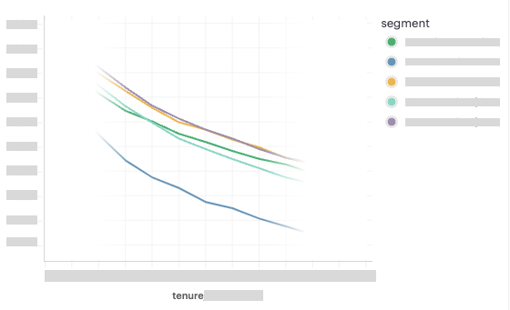

# Measuring the impact of interaction with merchants

- Role: Data analyst
- Situation: Senior management wanted to start measuring the impact of the work done by the team, so that we can continuously improve our outcome.
- Task: Measure the impact created from interaction with merchants.
- Action: Quantitate the impact of the work done by the team.
- Result: Identified effective KPI and method of measurement to track the impact of the work done by the Theme Support team.


### TL;DR

As Theme Support Specialists at Shopify we create value for our merchants through customisation that adds value to their business.

About an year after joining the team I was asked by the senior management to quantitate the value we are creating for our merchant so that we may continue to improve our performance.

### Research #1 

#### Summary
Identified the possibility of calcurating the impact created for merchant store from Theme Support interaction. Confirmed GMV cannot be used to measure the impact as it was more influenced by the scale of the business.

#### Solution proposal & assessment

Using available data I was able to quantitate the impact created from specific area of customisation provided by Theme Support team.


However, I concluded that GMV was not suitable for measuring impact from interaction for two rasons. 1) In general it is skewed by the price of the product and exchange rate. 2) GMV growth rate is influenced by the scale of business of the merchants we support, and the make up of the segments of merchants supported differed significantly between each support team.


_The segments losely represented the scale of the business, which in turn was the dominant factor for the GMV growth rate._

### Research #2

#### Summary
Confirmed effectiveness of **orders** over GMV, to measure the impact of support interaction. We have also confirmed the effectiveness of **bounce rate** and **product view** as early indicators of the impact created by Theme Support team.

#### Hypotheses building
Previous research recommended **orders** as the alternative to GMV as they are not skewed by the price of the product nor by the exchange rate. However the number of orders also falls short of being an ideal metric to measure the impact of Theme Support team, as it is influenced by the availability of the product, as well as discount and other promotional activities.

Since most customisation provided by Theme Support improves Usability & Trust of the online store and they have direct influence on increasing **product view** & reducing **bounce rate**, I've explored if they can be used to measure the impact created by the team with more sentivity.

#### Solution proposal & assessment
The first exploration confirmed direct correlation between the number of orders and product view, and inverse correlation between the number of orders and bounce rate:


The second exploration confirmed strong association between bounce rate / product view and Theme Support interaction, as the cotrol group (generic support) had no significant change in bounce rate / product view after interaction.


The third exploration confirmed the sensitivity of the metrics to measure the impact created by Theme Support team. Orders and product view significantly improved immidately after interaction with Theme Support team compared to the control group.


### 2. Hypotheses building

1. Find metrics other than GMV to measure the impact of Theme Support, as **GMV** growth rate was more influenced by the scale of the business.
1. Find a way to **isolate the base growth rate** to measure the true impact created by Theme Support team. - As we felt merchants reaching out to escalated support is generally more motivated and have higher natural growth rate.
1. ~~Find **metrics with higher sensitivity** to measure the impact from small sample size, as the demand for each customisations differ significantly.~~


### 3. Solution proposal


### 4. Solution assessment


Original wording **before** the change
```
Total tickets: 363
Missing link to theme file: 21
Missing rate: 5.79%
```
New wording **after** the change
```
Total tickets: 210
Missing link to theme file: 23
Missing rate: 10.95%
```

Given the rate of ticket missing the link to theme had risen from 5.79% to 10.95% with high statistical significance (P Value at 0.185% using Chi^2 Test), I quickly proceeded to reverse the wording to original as a quick fix.

```
Expected		12.15
ChiSq / P value		0.00185
```


### 5. Result & Learnings

The project sparked active discussion among the colleagues and completed with **successfully reducing the error rate from 40.21% down to 0.15% in 59 days**. Impact was equiverant to reducing of 7 days worth of specialist labour.


### BOTS

- Theme Support had higher retention rate compared to generic support team, but were at par with other escalated support teams.
- Theme Support had higher GMV & conversion rate compared to generic support team, but lower than other escalated support teams.

While we were able to find inferences to Theme Support having higher GMV & conversion rate compared to generic support team, but lower than other escalated support teams, we were not able to isolate the impact unless we are comparing the same segment of merchants.


