# Measuring the impact of interaction with merchants

- **Role**: Data Analyst
- **Situation**: Senior management wanted to start measuring the impact of the work done by the team to continuously improve our outcome.
- **Task**: Measure the impact created from interaction with merchants.
- **Action**: Quantify the impact of the work done by the team.
- **Result**: Identified effective metrics and method of measurement to track the impact of Theme Support Specialist interaction.

## TL;DR

As Theme Support Specialists at Shopify we create value for our merchants through customisation that adds value to their business.

About a year after joining the team, I was asked by senior management to quantify the value we are creating for our merchants so that we may continue to improve our performance.

## 1. Preliminary research part one

### Summary

- Identified the possibility of calculating the impact created for merchant stores from Theme Support interaction.
- Confirmed **Gross Merchandise Value (GMV) cannot be used to measure the impact** as it was more influenced by the scale of the business.

### Solution proposal & assessment

Using available data, I was able to quantify the impact created from specific areas of customisation provided by the Theme Support team.

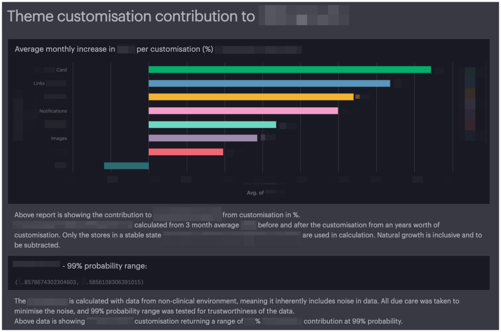

However, I concluded that GMV was not suitable for measuring the impact from interaction for two reasons: 1) In general, it is skewed by the price of the product and exchange rate. 2) GMV growth rate is influenced by the scale of the business of the merchants we support, and the makeup of the segments of merchants supported differed significantly between each support team.

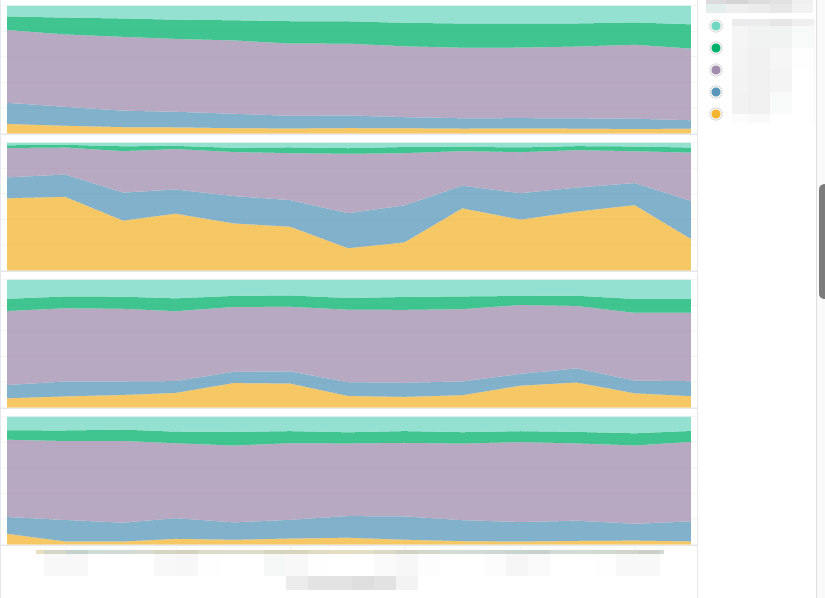
_The segments loosely represented the scale of the business, which in turn was the dominant factor for the GMV growth rate._

## 2. Preliminary research part two

### Summary

- Confirmed the effectiveness of **orders** over GMV to measure the impact of support interaction.
- Confirmed the effectiveness of **bounce rate** and **product view** as early indicators of the impact created by the Theme Support team.

### Hypotheses Building

Previous research recommended **orders** as an alternative to GMV, as they are not skewed by the price of the product nor by the exchange rate. However, the number of orders also falls short of being an ideal metric to measure the impact of the Theme Support team, as it is influenced by the availability of the product, as well as discounts and other promotional activities.

Since most customisations provided by Theme Support improve Usability & Trust of the online store and have a direct influence on increasing **product view** & reducing **bounce rate**I explored if they could be used to measure the impact created by the team with more sensitivity.

### Solution Proposal & Assessment

The first exploration confirmed a direct correlation between the number of orders and product view, and an inverse correlation between the number of orders and bounce rate:

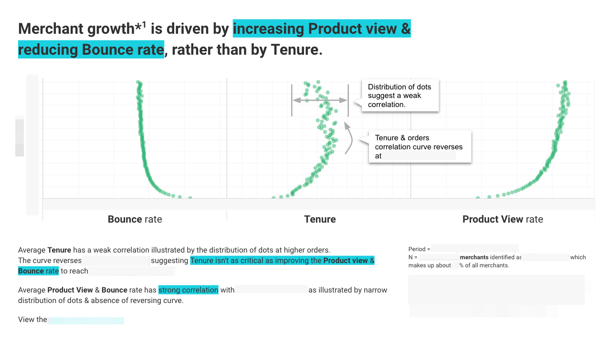

The second exploration confirmed a strong association between the key metrics (bounce rate & product view) and Theme Support interaction by comparing the metric improvement against generic support interaction.

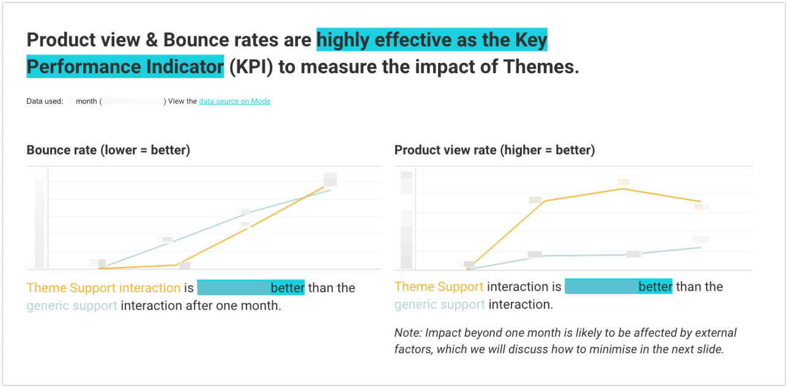

The third exploration inferred that the type of customisation determined the metric magnitude of the impact created, and the importance of tracking the **goal** of customisation.

For example, customisations around the product page improved the bounce rate but yielded minor improvement for the product view.

This is because most customisation requests we receive are focused on getting the customer to purchase the product, rather than browse more products. Hence, to accurately measure the impact of Theme Support interaction, we need to track the **goal** of the customisation.

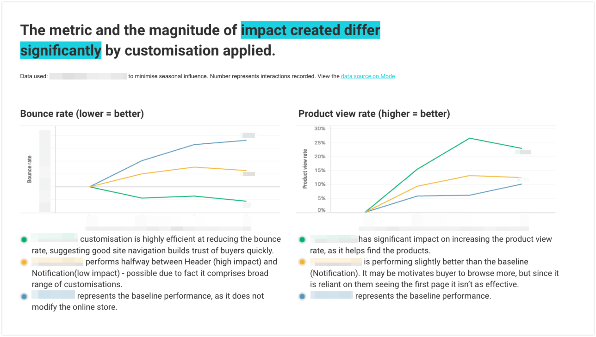

## 3. Hypotheses building

1. **Track the goal of customisation** to measure the impact of Theme Support interaction accurately and with higher sensitivity.
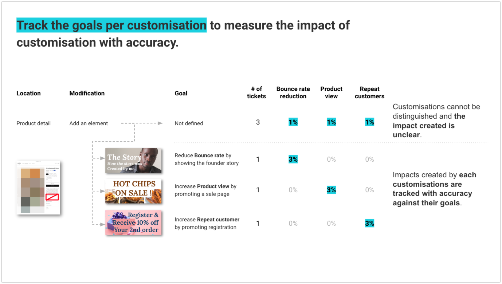

2. **Isolate the base growth rate** to measure the true impact created by the Theme Support team. This is important as we believe merchants reaching out for support are generally more motivated and have a higher natural growth rate.
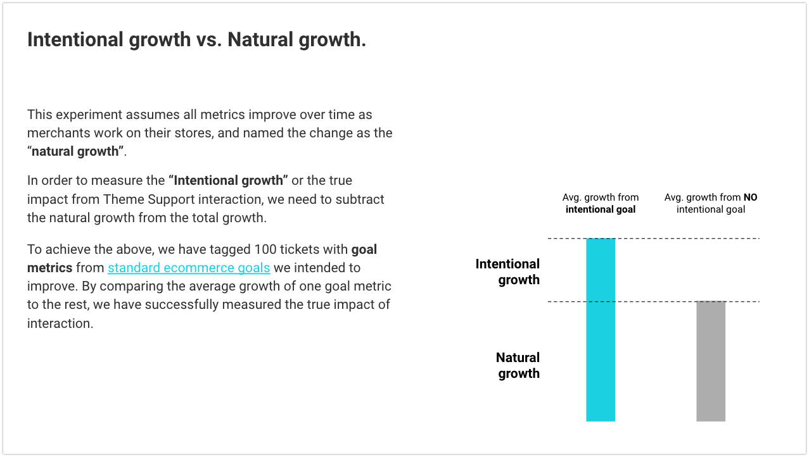

## 4. Solution proposal

#### Experiment objective
- Collect intended goal & metric per customisation to accurately measure the impact created by Themes.

#### Experiment design
- Recruit six Theme Support Specialists to participate in the experiment.
- Train the specialists on the goal category & metric definition, and provide examples of classification with real tickets.
- Assign 16-17 customisation tickets per specialist they have completed, to make up 100 sample tickets.
- Get specialists to record the most applicable goal category & metric for each customisation.
- Analyst to review the goal & metric recorded by the specialist and correct errors if required.

**Note**:

- 100 samples are below the minimum sample size required for statistical significance but were deemed sufficient as a quick experiment to validate the hypothesis.
- Specialists were encouraged to request additional metrics if required.
- Additional metrics were reviewed and immediately made available for selection by the Analyst.

#### Resources

Data Analyst x1
- Training & support: 1 hour + (10 min x6 specialists) = 2 hours
- Mode report set up: 10.75 hours
- Analysis: 4.25 hours

Theme Support Specialist x6
- Ticket review: 1 hour x 6 specialists = 6 hours

Documents
- Customer journey framework
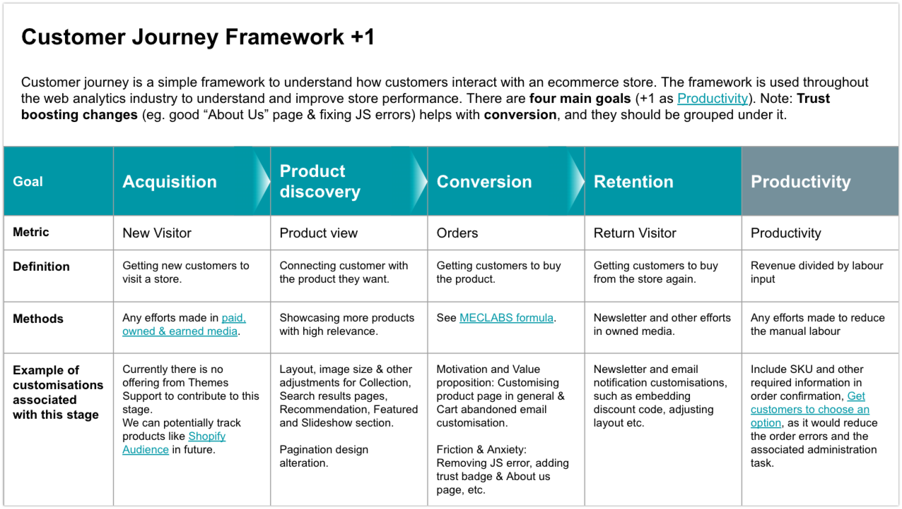
- Tracking instruction
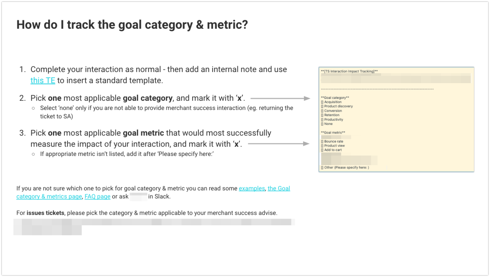

## 5. Solution assessment

**TL;DR**: Tracking goal metrics is **highly effective** in separating intended growth from natural growth.

- The interaction with product view as the goal had recorded an average growth of X%, while interactions with other goals produced Y% growth on average.
- We can calculate the true impact of **Theme Support interaction to be 43% higher** than the natural growth rate.
- Using a T-Test, we can confirm the difference between the intended & natural growth is **statistically significant with 99% confidence**. Meaning, the result is highly unlikely to be due to coincidence.

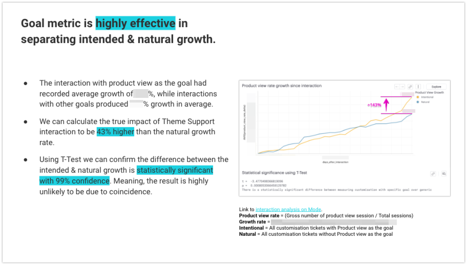

## 6. Result & Learnings

The experiment successfully **proved the hypothesis that tracking the goal of customisation is effective** in measuring the impact of Theme Support interaction with higher sensitivity.

In addition, the base growth rate provided a benchmark for us to identify which customisation is delivering the impact beyond the natural growth rate with statistical significance.
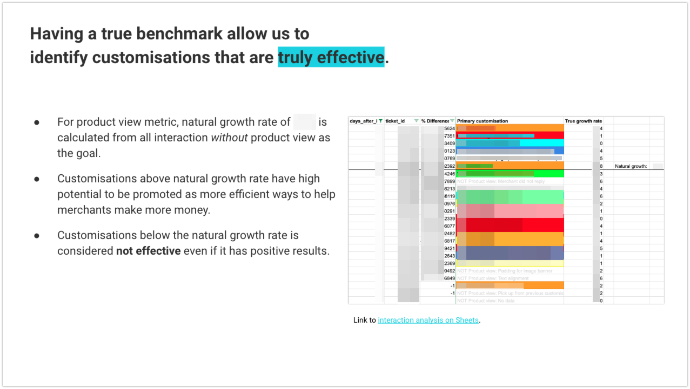

Lastly, the qualitative analysis of participants' feedback confirmed the process had **no negative impact on their tasks** and agreed that collecting objective insights about the impact of customisation is invaluable.

The experiment was concluded with advice to extend the experiment to the entire Theme Support team and to be integrated into the daily workflow.