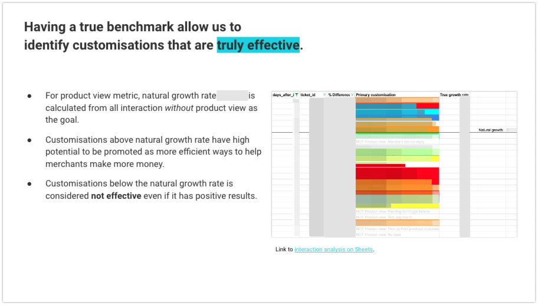

# Measuring the impact of interaction with merchants

- Role: Data analyst
- Situation: Senior management wanted to start measuring the impact of the work done by the team, so that we can continuously improve our outcome.
- Task: Measure the impact created from interaction with merchants.
- Action: Quantitate the impact of the work done by the team.
- Result: Identified effective KPI and method of measurement to track the impact of the work done by the Theme Support team.

## TL;DR

As Theme Support Specialists at Shopify we create value for our merchants through customisation that adds value to their business.

About an year after joining the team I was asked by the senior management to quantitate the value we are creating for our merchant so that we may continue to improve our performance.

## Research #1 

#### Summary

- Identified the possibility of calcurating the impact created for merchant store from Theme Support interaction. 
- Confirmed **GMV cannot be used to measure the impact** as it was more influenced by the scale of the business.

#### Solution proposal & assessment

Using available data I was able to quantitate the impact created from specific area of customisation provided by Theme Support team.

However, I concluded that GMV was not suitable for measuring impact from interaction for two rasons. 1) In general it is skewed by the price of the product and exchange rate. 2) GMV growth rate is influenced by the scale of business of the merchants we support, and the make up of the segments of merchants supported differed significantly between each support team.

_The segments losely represented the scale of the business, which in turn was the dominant factor for the GMV growth rate._

## Research #2

#### Summary
- Confirmed effectiveness of **orders** over GMV to measure the impact of support interaction. 
- Confirmed the effectiveness of **bounce rate** and **product view** as early indicators of the impact created by Theme Support team.

#### Hypotheses building
Previous research recommended **orders** as the alternative to GMV as they are not skewed by the price of the product nor by the exchange rate. However the number of orders also falls short of being an ideal metric to measure the impact of Theme Support team, as it is influenced by the availability of the product, as well as discount and other promotional activities.

Since most customisation provided by Theme Support improves Usability & Trust of the online store and they have direct influence on increasing **product view** & reducing **bounce rate**, I've explored if they can be used to measure the impact created by the team with more sentivity.

#### Solution proposal & assessment
The first exploration confirmed direct correlation between the number of orders and product view, and inverse correlation between the number of orders and bounce rate:

The second exploration confirmed strong association between the key metrics (bounce rate & product view) and Theme Support interaction by comparing the metric improvement against generic support interactin.

The third exploration inferred the type of customisation determined the metric magnitude of impact created, and importance of tracking the **goal** of customisation.

For example, customisations around product page improved the bounce rate, but yielded minor improvement for the product view.

This is because most customisation we receive is focused on getting the customer to purchase the product, rather than browse more products. Hence to accurately measure the impact of Theme Support interaction, we need to track the **goal** of the customisation.

## 2. Hypotheses building

1. **Track the goal of customisation** to measure the impact of Theme Support interaction with accurately and higher sensitivity.

1. **Isolate the base growth rate** to measure the true impact created by Theme Support team. This is important as we believe merchants reaching out for supportis generally more motivated and have higher natural growth rate.

## 3. Solution proposal

#### Experiment objective
- Collect intended goal & metric per customisation to accurately measure the impact created by Themes.

#### Experiment design
- Recruit six Theme Support Specialists to participate in the experiment.
- Train the specialists on the goal category & metric definition, and provide examples of classification with real tickets.
- Assign 16-17 customisation tickets per specialist they have completed, to make up 100 sample tickets.
- Get specialists to record the most applicable goal category & metric for each customisation.
- Analyst to review the goal & metric recorded by the specialist, and correct errors if required.

Note:
- 100 samples is below the minimal sample size required for statistical significance, but was deemed sufficient as a quick experiment to validate the hypothesis.
- Specialist were encouraged to request additional metrics if required
- Addtional metrics were reviewed and immidiately made available for selection by the Analyst.

#### Resources

Data analyst x1
- Training & support: 1 hour + (10 min x6 specialists) = 2 hours
- Mode report set up: 10.75 hours
- Analysis: 4.25 hours

Theme Support Specialist x6
- Ticket review: 1 hour x 6 specialist = 6 hour

Documents
- Customer journey framework

- Tracking instruction

## 4. Solution assessment
TL;DR: Goal metric is **highly effective** in separating intended & unintended (natural) growth.

- The interaction with product view as the goal had recorded average growth of X%, while interactions with other goals produced Y% growth in average. 
- We can calculate the true impact of **Theme Support interaction to be 43% higher** than the natural growth rate.
- Using T-Test we can confirm the difference between the intended & natural growth is **statistically significant with 99% confidence**. Meaning, the result is highly unlikely to be due to coincidence.

### 5. Result & Learnings

The experiment successfully **proved the hypothesis that tracking the goal of customisation is effective** in measuring the impact of Theme Support interaction with higher sensitivity.

In addition, the base growth rate provided a benchmark to for us to identify  which customisation is deliverling the impact beyond the natural growth rate with statistical significance.

Lastly, the qualitative analysis of participant's feedback have confirmed the process had virtually no impact on their task, and agreed collecting the objective insights about the impact of customisation is invaluable.

Experiment was concluded with advise to extend the experiment to entire Theme Support team, and to be integrated into the daily workflow.
