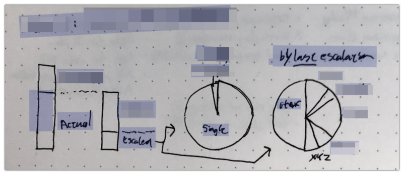
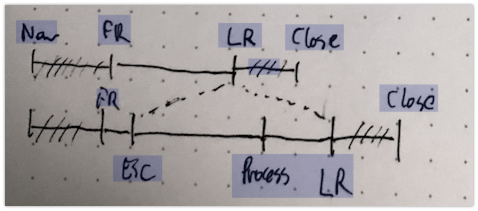
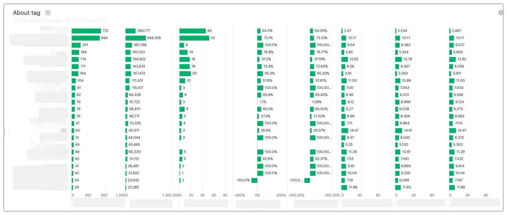
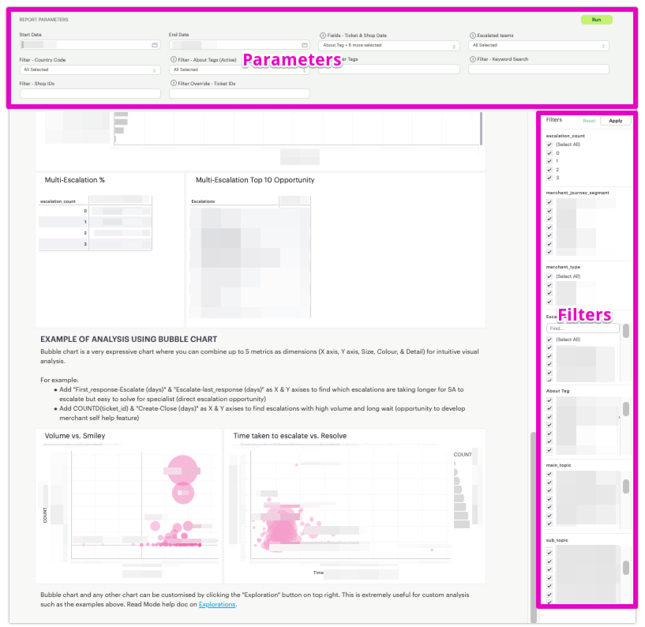
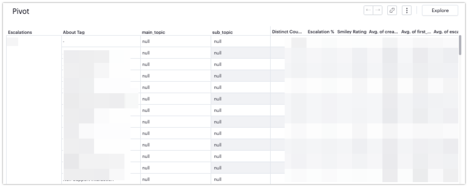
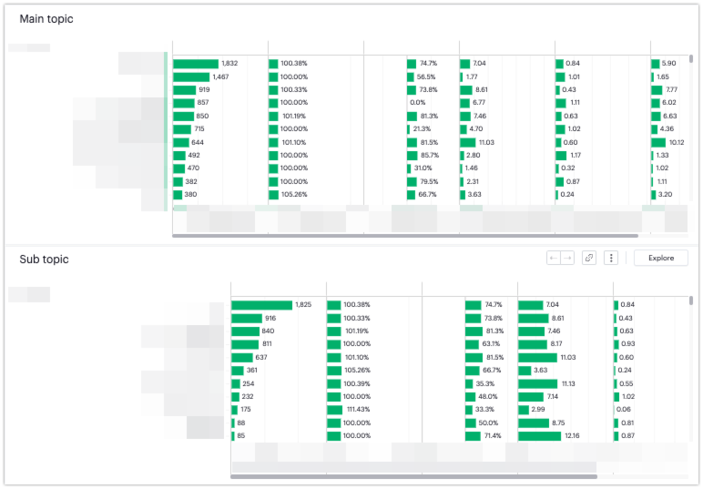
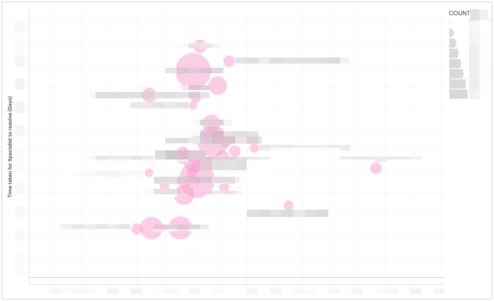

# Reducing the cost of support

- Role: Data Engineer / Analyst
- Situation: Ad-Hoc request to optimise support escalation process.
- Goal: Analyse and identify the opportunity for optimisation (such as feature development & direct escalation) to reduce the total cost of support.
- Action: Design and build a dashboard to compare cost and impact across all escalated support teams.
- Result: Complete analytics dashboard and user guide built on Mode. Sample analysis and opportunity with demonstration to self drive further analysis.

### TL;DR

Support management was looking to reduce the total cost of support by identifying opportunities for optimisation (such as feature development & direct escalation). This project aims to build a dashboard to compare cost and impact across all escalated support teams.
Example: _Identify and build UI for a simple & repetitive processes that currently require internal tools._

### Requirements

#### Usability
  - Intended user for the report were intermediate Mode users without SQL knowledge. 
  - I've designed the reports to be used with Mode's built-in features like Filter & Parameters for maximum flexibility and minimum waiting time when performing self-drive analysis.
  - Brief documentation and training were provided to enable self driven advanced analysis.

#### Feasibility
  - Minimum reporting period required by project was 6 months, but combined SQL query from the two reports exceeded maximum time allowed by Mode, and had to be optimised to run, let alone develop.
  - I have used various approaches (such as finding pre-aggregated table, clarifying the use and need of some metrics, and optimising the query itself) to reduce the query time down to just under 12 minutes.

#### Speed
  - Originally given a week to complete the project due to demand in core work and completed in 4 days.
  - Additionally, the scale & significance of the problem was not provided, and had to be investigated within a project.
  
  - While optimising the SQL the code was overhauled to be more modular and maintainable, which also helped to develop the query faster by turning off the part of query not required for the current development.

---

### 1. Preliminary research 

#### 1.1 Existing documents and resources
Found following resources that could be used to build the dashboard:

- Arbitrary list of ideas for feature development.
- Current reporting tool (two dashboards requiring copy paste to work together, not ideal).

#### 1.2 Missing metrics
Some key metrics necessary for analysis are missing from the current reports and need to added:

- Time spent on ticket
  - Interaction broken down by team, including the frontline support.
  - Total time taken from creation to closure of a ticket.
- CSAT (Customer Satisfaction)
  - Smiley rate.
  - Smiley response rate (to calculate confidence interval).

#### 1.3 Classification improvement
Current classification method lacked uniformity and granularity required to adequately compare escalation teams.
- Investigation and ad-hoc classification was necessary. 
- This may require interview with SME (Subject Matter Experts) from respective teams.

### 2. Hypotheses building & Solution Proposal

#### 2.1 Development policy
Combine the two reports to create a wide table, then use built-in reporting and visualisation to achieve the goal with minimal development cost.
  - May explore expanding tags used for tickets to individual rows to enable more granular analysis.

#### 2.2 Add required metrics
  - Since most teams do not track the actual time spent on each ticket, I used the escalation & close time stamp to calculate the gross time spent between stages of ticket lifecycle (Ticket create, first response, escalation, last response). Since the conditions are the same for all teams the metric should be comparable.
  
  - Smileys are only available for tickets where the merchants had responded, so I'd need to report the statistical significance of the sample size to ensure the result is not skewed by the lack of response.

#### 2.3 Develop and test the effectiveness of the new dashboard
Using the new wide table, perform a sample analysis and present the insights to demonstrate the practicality and effectiveness of the dashboard.

### 3. Solution assessment

#### 3.1 Integrating two main reports
- Basic integration was fairly simple and done without any issues.
- One column contained array of tags, which presented option to expand them to compare the frequency etc.
- After investigating the effects of having multiple tags on a ticket on metrics, the complexity of interpretation & operation and the intended user, it was decided not to expand the tags.

#### 3.2 Metrics

##### CSAT
- Confirmed response rate for smiley is around 10% per category.
- Using [statistical significant sample size](https://www.qualtrics.com/blog/calculating-sample-size/) I've confirmed the answer rate is highly likely to yield enough statistical power to be representative of the population.

##### Time taken
- Confirmed all teams do not track time spent on tickets with one exception, and opted to calculate time taken between stages of ticket lifecycle (Ticket create, first response, escalation, last response).

##### Inclusion conditions
  - Ticket status must be closed to capture the fixed state.
  - Remove outliers.
    - How do I identify outliers (Tickets that took extremely long time to close)?
    - My assumption is that these are bugs that took long time to fix, so it would be nice to separate from 'repetitive' tasks (more so focus on this research) 
    - The longer ones are most likely to be attached to Problem Tickets or Github issues 
  - Remove multiple escalations touch tickets - Since the volume is relatively small I've opted to exclude them in some reports to simplify interpretation.

#### 3.3 Dashboard design

##### Filters (Reporting controls)

- The **Number of escalations** was the key configuration for the report due to the fact it needed to include "0" to calculate escalation rate, then turn them off to focus on escalated tickets, hence this is at the top of the filter panel.
- **Merchant segment** and **Merchant type** were added as key requirement to isolate the impact of the opportunity and were added below, followed by **Escalated team**, the main interest of the report.
- **Main topic**, **Sub topic**, and **About tag** were added to enable unified comparison of escalation volume at various granularity across all escalated teams.
- 'Other tags' were removed from filter due to high cardinality (and limitation in Mode UI, understandably from poor UX even if it were to implement).

##### Parameters (Query controls)

- Standard Start & End date controls
- **Fields - Tickets & Shop Data** controls the group of columns to be included in the report.
- **Escalated teams** controls the list of teams to be included in the report.
- **County Code** inherited from previous report, may be useful to isolate language related or regional factors.
- **Other tag** inherited from previous report. Require the user to know the exact tag to use but useful for granular drill down analysis.
- 'Keyword Search', 'Shop IDs', Ticket IDs' inherited from previous report.

##### Reports (Visualisation)

- Confirmed the **Drill down** feature in Mode is only available for time series data and not for tabular data:

- It was not feasible to prepare drill down reports for all escalated teams, hence I've opted to use the 'Filter' function to achieve the same results.

- Finally I've settled on using **Bubble chart** as it can represent up to 4 dimensions of data (X, Y, Size, Colour) per categorisation (such as escalated team, main or sub topic) to quickly compare the impact of the opportunity and challenge at a glance:

- Use of parameters to swap the dimensions was considered for ease of use by the target user, but dismissed as request would take too long (over 10 minutes) and other adjustments (like filtering and updating the X & Y scale) were still necessary to make practical analysis.

##### Metrics & Classification
- While **About tag** was available for all tickets, it failed to offer the granularity needed to understand the context of each escalation. 
- **Main topic** & **Sub topic** classifications are designed to be heterogeneous specifically to represent the volume and offer team specific context to assist the analysis.

### 4. Result & Learnings

Dashboard was well received by the senior management who commissioned the dashboard as "beyond what I expected" and "very useful".

Bubble chart was highly effective in finding quick win opportunities such as email deliverability queries that take longer for frontline to escalate but relatively quick for the escalated teams to resolve.

I have further acquired the knowledge around the advantage and limitation of Mode reporting, and gained more skills around SQL optimisation and development. 

I felt the production time could be further reduced with more frequent communication with the stakeholders.

